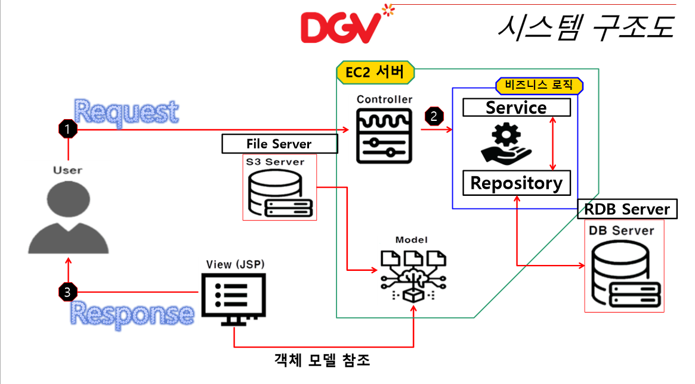

# :clapper: DGV Team Project

  

# :zap: 영화예매사이트 

<h3 align="center">⭐use as the  main⭐</h3>

   
   
  
   
   
   
  
  
  
  
  
  
  
  
  
  
  

 

  

## 1. 개발동기
---
>팀프로젝트 주제를 찾던도중 예매프로그램이 어렵다는 이야기를 듣고 관심이 생겨 팀원들과 합의하에 진행하게되었습니다.

 

## 2. 프로젝트 설명
---
 
### &nbsp;&nbsp;&nbsp;&nbsp;2-1 기능

|:small_orange_diamond: 사용자 기능 |
|:----------|
|   :white_check_mark: (Ajax) 영화 예매를 위한 영화, 도시, 지역, 날짜, 상영관, 인원수 등 선택가능 
|   :white_check_mark: 총 예매가격에 쿠폰과 포인트 사용, 적립이 가능하며 영화 목록에서는 예매율    표시| 
|   :white_check_mark: 카카오 api를 이용한 지도와 소셜 로그인, 소식전하기 등 활용|
|   :white_check_mark: 예매시 개인 예매 완료 문자, 취소시 예매 환불 문자|
|   :white_check_mark: 커뮤니티(게시판) search기능, 답급기능, 작성후 24시간기준 시간표시   &nbsp;&nbsp;&nbsp;&nbsp; (ex 몇초전, 몇분전, 몇시간전)|
|   :white_check_mark: S3를 사용한 이미지 업로드 구현|
|   :white_check_mark: Amazon AWS Ec2 서버 구축 |
|   :white_check_mark: 예매완료후 영수증 출력가능 (PDF출력)|

---
 

|:small_orange_diamond: 관리자 기능 |
|:----------|
|   :white_check_mark: 영화상태 제어가능 (ex 상영중, 상영예정, 상영종료|
|   :white_check_mark: 회원 단체 문자 전송가능(소식 알릴때)|
|   :white_check_mark: 영화 등록, 인물 등록 시 S3를 사용한 이미지 업로드 구현(ThumbNail|
|   :white_check_mark: Excel 출력 (총 결제내역)|
|   :white_check_mark: Event 등록민 진행시 당첨자 지정,발표|
|   :white_check_mark: 쿠폰 관리, 사용자 등급관리, 약관관리, 통계 등|

---
 
 

### &nbsp;&nbsp;&nbsp;&nbsp;2-2 프로젝트 기간

&nbsp;&nbsp; :clock1: 2022. 03. 01  - 2022. 04. 08 

---
 

### &nbsp;&nbsp;&nbsp;&nbsp;2-3 프로젝트 인원 

&nbsp;&nbsp; :gift_heart: 5명

---

 
 

## 3. 시스템 구조도
---

 
 

## 4. 시연

<iframe width="640" height="360" src="./src/main/webapp/resources/video/user_one.mp4" frameborder="0" gesture="media" allowfullscreen=""></iframe>

 
 

## 5. 개발 환경

| :small_blue_diamond: 분류   | :small_orange_diamond: 개발환경 |
|:--------------:|:--------------:|
| 운영 체제 | Windows 10 64bit |
| 개발 언어 | Java |
| 개발 도구 | Eclipse, PgAdmin, PUTTY, Maven, Java ORM Plugin |
| Framework | Spring Framework 5.3.4, MyBatis, Bootstrap |
| Database | PostgreSQL 12.9 |
| WAS | Apache Tomcat 9.0 |
| Web&nbsp;browsr | Chrome | 
| 버전관리 | Git, Github | 
| Library | JSTL, lombok, aspectj, servlet-api, spring-security-web, jackson, itextpdf, poi, amazonaws, commons-fileupload, javax.mail |
| API | KakaoMap API, Kakao Login API, IamPort API | 

 
 
 

